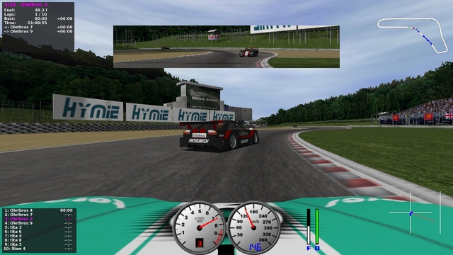

# Autonomous Racing Car

A controller for a self-driving racing car in the TORCS platform, implemented as part of the UvA/VU course Computational Intelligence (Fall 2016). The controller was trained with a Multilayer Perceptron using the DL4J Java library. The resulting weights were optimized by means of differential evolution. See [report](report/report.pdf) or [presentation](report/slides.pdf). Project won the first prize in the annual Computational Intelligence contest associated with the course. 

